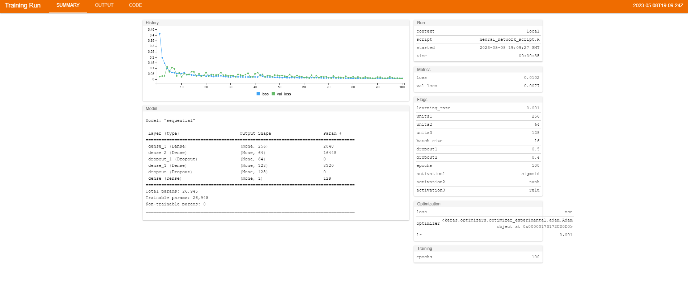

# Final Project

## Predict the chance of admission of a student in a particular university

```{r}
library(ggcorrplot)
library(lattice)
library(glmnet)
library(mltools)
library(data.table)
library(keras)
library(tfruns)
library(tidyr)
library(GGally)
library(purrr)
library(knitr)
library(scales)
library(psych)
library(dplyr)
library(caret)
library(ggplot2)

```

```{r}
data <- read.csv("Admission_Predict.csv")
data
```

### Exploratory Data Analysis

```{r}
str(data)
```

```{r}
summary(data)
```

There are total 9 variables among which we do not need the serial number variable.

The variable names and their explanations are as follows:

1.  **Serial.No.:** A unique identifier for each student in the dataset.

2.  **GRE.Score:** The student's score on the Graduate Record Examination (GRE) standardized test.

3.  **TOEFL.Score:** The student's score on the Test of English as a Foreign Language (TOEFL) standardized test.

4.  **University.Rating:** The rating of the university where the student is applying, on a scale of 1 to 5.

5.  **SOP:** The student's Statement of Purpose (SOP) score, as rated by the university admissions committee.

6.  **LOR:** The student's Letter of Recommendation (LOR) score, as rated by the university admissions committee.

7.  **CGPA:** The student's Cumulative Grade Point Average (CGPA) from their undergraduate studies.

8.  **Research:** A binary variable indicating whether or not the student has research experience.

9.  **Chance.of.Admit:** The probability of the student being admitted to the university, as determined by the university admissions committee.

We are going to remove the serial number from the data as it is not necessary.

The Chance.of.Admit is our target variable.

```{r}
data = data[, -c(1)]
data
```

Lets see if there is any missing values in any column of dataset.

```{r}
colSums(is.na(data))
```

We do not have any missing value in our data.

Now we are going to show the distribution of our target variable.

```{r}
Chances_of_Admission <- data$Chance.of.Admit
options(scipen=999)
# Distribution of Chance.of.Admit
hist(data$Chance.of.Admit, col="#0073c2ff",
     border = "white",
     probability = TRUE,
     xlab = "Chances of Admission",
     main="Distribution of target Variable (Chance.of.Admit)"
     )
```

In this dataset, the categorical variables are:

-   Serial.No.: This variable represents a unique identifier for each student in the dataset. Although this variable is represented by integers, it is a categorical variable since it is just a label and doesn't have any numerical meaning or order.

-   University.Rating: This variable represents the rating of the university where the student is applying, on a scale of 1 to 5. Even though the variable is represented by integers, it is a categorical variable because it has a fixed set of values that do not have any numerical order.

-   Research: This variable is a binary variable indicating whether or not the student has research experience. It only has two possible values, 0 or 1, and therefore is a categorical variable.

The numerical variables in the dataset are:

-   GRE.Score: The student's score on the Graduate Record Examination (GRE) standardized test.

-   TOEFL.Score: The student's score on the Test of English as a Foreign Language (TOEFL) standardized test.

-   SOP: The student's Statement of Purpose (SOP) score, as rated by the university admissions committee.

-   LOR: The student's Letter of Recommendation (LOR) score, as rated by the university admissions committee.

-   CGPA: The student's Cumulative Grade Point Average (CGPA) from their undergraduate studies.

-   Chance.of.Admit: The probability of the student being admitted to the university, as determined by the university admissions committee.

First we are going to find the association between the target variable and all other numeric variables.

```{r}
# Extract all numerical variables from the original dataframe

numerical_data <- c("GRE.Score", "TOEFL.Score", "SOP", "LOR", "CGPA", "Chance.of.Admit")

#make a dataframe of those numerical variable 
data_num <- data[,numerical_data]

# find correlation of all numerical variables
corr<-cor(data_num)
my_corr<-ggcorrplot(corr,hc.order = TRUE, type = "lower",  title = "The association between Continous variables", outline.col = "white")
my_corr + theme(axis.text.x = element_text(size = 10), axis.text.y =
element_text(size = 10))
```

```{r}
corr
```


```{r}
# Create scatter plots for each numeric variable with Chance.of.Admit
plots <- lapply(numerical_data, function(x) {
  ggplot(data, aes(x = !!sym(x), y = Chance.of.Admit)) + 
    geom_point() +
    labs(x = x, y = "Chances of Admission")
})

# Print all plots
for (plot in plots) {
  print(plot)
}

```

```{r}
df1 = data[, c(numerical_data)]
model <- aov(Chance.of.Admit ~ ., data=df1)
summary(model)
```

While looking at p-values, we can say that there is a significant association between target variable and all other continuous variables.

```{r}
# identify categorical variables
cat_vars <- c("University.Rating", "Research")

cat_df <- data[, c("Chance.of.Admit", cat_vars)]
cat_df$University.Rating <- factor(cat_df$University.Rating)
cat_df$Research <- factor(cat_df$Research)
str(cat_df)
```

```{r}
# Create boxplots for each categorical variable
for (var in cat_vars) {
  p <- ggplot(cat_df, aes(x = .data[[var]], y = Chance.of.Admit, fill = .data[[var]])) +
    geom_boxplot() +
    labs(title = paste("Boxplot of Chance.of.Admit by", var), x = var, y = "Chance.of.Admit") +
    theme(plot.title = element_text(size = 16), axis.title = element_text(size = 14), axis.text = element_text(size = 12)) +
    scale_fill_hue(name = var)
  print(p)
}
```

```{r}
for (var in cat_vars) {
  
  t <- table(cat_df[[var]], cat_df$Chance.of.Admit)
  
  chisq <- chisq.test(t)
  cat(paste0("Chi-squared test for association between Chance.of.Admit and ", var, ":\n"))
  print(chisq)
  cat("\n")
}
```

After all the tests and plots, we can conclude that all our variables are strongly associated with the target variables.

Finally we are going to split our dataset into training and testing data using caret createDataPartition method.

```{r}
inTrain <- createDataPartition(data$Chance.of.Admit, p = 0.8, list = F)
train_data <-  data[inTrain, ]
test_data <- data[-inTrain, ]
```

```{r}
dim(train_data)
dim(test_data)
```

### Creating Predictive model:

### Creating Regularized Linear Regression Models

#### 1- Lasso Regression:

```{r}
set.seed(1234)
tr_ctr = trainControl( method = "repeatedcv",
                       number = 10,
                       repeats = 5,
                       verboseIter = T
                       )
lasso <- train(
  Chance.of.Admit ~ .,
  data = train_data,
  preProcess = c("knnImpute", "nzv"),
  method = "glmnet",
  tuneGrid = expand.grid(alpha= 1,
                         lambda = seq(0.01, 0.2, length = 5)),
  trControl =  tr_ctr 
)
```

```{r}
# print the tuned parameter
lasso$bestTune
```

```{r}
# get the coefficients for the best tuned model
lasso_coefficient <- coef(lasso$finalModel, s = lasso$bestTune$lambda)
lasso_coefficient
# check if Lasso shrink some of the coefficients to zero
sum(lasso_coefficient[-1] == 0) > 0
```

```{r}
plot(varImp(lasso, scale = T  ))
```

```{r}
predictions<- predict(lasso, 
             newdata = test_data,
             )

lasso_rmse <- RMSE(predictions, test_data$Chance.of.Admit)
cat(paste("The RMSE Value of Lasso Regression is: ", lasso_rmse))
```

#### 2- Ridge Regression:

```{r}
set.seed(1)
tr_ctr = trainControl( method = "repeatedcv",
                       number = 10,
                       repeats = 5,
                       verboseIter = T
                       )
ridge <- train(
  Chance.of.Admit ~ .,
  data = train_data,
  
  preProcess = c("knnImpute", "nzv"), 
  method = "glmnet",
  tuneGrid = expand.grid(alpha= 0,
                         lambda = seq(0.0001, 1, length = 5)),
  trControl =  tr_ctr 
)

```

```{r}
plot(varImp(ridge, scale = T  ))
```

```{r}
predictions<- predict(ridge, 
             newdata = test_data,
             
             )

ridge_rmse <- RMSE(predictions, test_data$Chance.of.Admit)
cat(paste("The RMSE Value of Ridge Regression is: ", ridge_rmse))
```

#### 3- Elastic Net Regression:

```{r}
set.seed(1)
tr_ctr = trainControl( method = "repeatedcv",
                       number = 10,
                       repeats = 5,
                       verboseIter = T
                       )
elastic_net <- train(
  Chance.of.Admit ~ .,
  data = train_data,
  
  preProcess = c("knnImpute", "nzv"), 
  method = "glmnet",
  tuneGrid = expand.grid(alpha= seq(0,1,length = 10),
                         lambda = seq(0.0001, 0.2, length = 5)),
  trControl =  tr_ctr 
)
```

```{r}
plot(varImp(elastic_net, scale = T))
```

```{r}
predictions<- predict(elastic_net, 
             newdata = test_data,
             
             )

en_rmse <- RMSE(predictions, test_data$Chance.of.Admit)
cat(paste("The RMSE Value of Elastic Net Regression is: ", en_rmse))
```

### Creating Tree-Ensemble and SVM Models

#### 4- Random Forest Model:

```{r}
set.seed(1)
tr_ctr = trainControl( method = "repeatedcv",
                       number = 10,
                       repeats = 5,
                       verboseIter = T
                       )
rndmForest <- train(
  Chance.of.Admit ~ .,
  data = train_data,
  preProcess = c("knnImpute", "nzv"), 
  method = "rf",
  importance = T,
  trControl =  tr_ctr
  
)
```

```{r}
plot(varImp(rndmForest, scale = T))
```

```{r}
p_rf<- predict(rndmForest, 
             newdata = test_data,
             )

rf_rmse <- RMSE(p_rf, test_data$Chance.of.Admit)
cat(paste("The RMSE Value of Random Forest Model is: ", rf_rmse))
```

#### 5- Gradient Boosted Model:

```{r}
set.seed(1)
tr_ctr = trainControl( method = "repeatedcv",
                       number = 10,
                       repeats = 5,
                       verboseIter = T
                       )
gbm <- train(
  Chance.of.Admit ~ .,
  data = train_data,
  method = "gbm",
  trControl =  tr_ctr
  
)
```

```{r}
p_gbm<- predict(gbm, 
             newdata = test_data,
             )

gbm_rmse <- RMSE(p_gbm, test_data$Chance.of.Admit)
cat(paste("The RMSE Value of Gradient Boosted is: ", gbm_rmse))
```

#### 6- Linear SVM Model:

```{r}
set.seed(1)
tr_ctr = trainControl( method = "repeatedcv",
                       number = 10,
                       repeats = 5,
                       verboseIter = T
                       )
svm <- train(
  Chance.of.Admit ~ .,
  data = train_data,
  preProcess = c("knnImpute", "nzv"), 
  method = "svmLinear",
  importance = T,
  trControl =  tr_ctr
  
)
```

```{r}
p_svm <- predict(svm, 
             newdata = test_data,
             )

svm_rmse <- RMSE(p_svm, test_data$Chance.of.Admit)
cat(paste("The RMSE Value of Linear SVM Regression is: ", svm_rmse))

```

#### 7- Radial SVM:

```{r}
set.seed(1)
tr_ctr = trainControl( method = "repeatedcv",
                       number = 10,
                       repeats = 5,
                       verboseIter = T
                       )
svmRad <- train(
  Chance.of.Admit ~ .,
  data = train_data,
  preProcess = c("knnImpute", "nzv"), 
  method = "svmRadial",
  importance = T,
  trControl =  tr_ctr
  
)
```

```{r}
p_svmRad <- predict(svmRad, 
             newdata = test_data,
             )

svmRad_rmse <- RMSE(p_svmRad, test_data$Chance.of.Admit)
cat(paste("The RMSE Value of Radial SVM is: ", svmRad_rmse))

```

Compare the RMSE of all the seven models we used above using resamples function

```{r}
model_list <- list(Lasso_Regression= lasso, Ridge_Regression = ridge, ElasticNet_Regression = elastic_net, RandomForest_Model = rndmForest, GradientBoost_Model = gbm, SVMLinear_Model = svm, SVMRadial_Model = svmRad)
res <- resamples(model_list)
summary(res)
```

The summary of resampling results shows the performance measures (MAE, RMSE, and Rsquared) for different machine learning models (Lasso Regression, Ridge Regression, ElasticNet Regression, Random Forest Model, Gradient Boost Model, SVM Linear Model, and SVM Radial Model) on a dataset. The resampling method used for evaluation was repeated k-fold cross-validation (k=10) with 50 repetitions.

For MAE and RMSE, the performance of all models is quite similar, with mean values ranging from 0.0449 to 0.0485 for MAE and 0.064 to 0.069 for RMSE. The median values are also similar for all models, indicating that the models are consistently performing well.

For Rsquared, all models have a mean value ranging from 0.773 to 0.80, indicating that the models are explaining 78-80% of the variation in the dataset. The interquartile range (IQR) is quite narrow, indicating that the performance is consistent across all repetitions.

Overall, the models appear to be performing well on the given dataset, with no significant difference in their performance.

### Creating Neural Network model:

```{r}
#Split the Training data again to 90% train and 10% validation
inTrain <- createDataPartition(train_data$Chance.of.Admit, p = 0.90, list = F)
train_df <- train_data[inTrain, ]
val_df <- train_data[-inTrain, ]
test_df <- test_data
```

we are not Imputing the missing values using knnImpute method, since we don't have any missing values.


Our categorical variables are already encoded and we do not need to encode them any more.

We will have to manually remove variables with little or no variance.

```{r}
nzv_train <- nearZeroVar(train_df)
nzv_train
```

Prepare the feature and target variables from train_df, test_df and val_df

```{r}
train_X <- as.matrix(train_df[,-1])
train_y <- train_df$Chance.of.Admit

test_X <- as.matrix(test_df[ ,-1])
test_y <- test_df$Chance.of.Admit

val_X <- as.matrix(val_df[ ,-1])
val_y <- val_df$Chance.of.Admit
```

Now we will create a neural network with atleast two hidden layers to predict the chances of Admission

```{r}
model <- keras_model_sequential() %>%
  layer_dense(units = 128, activation = "relu",
              input_shape = dim(train_X)[2]) %>%
  layer_dense(units = 64, activation = "relu") %>%
  layer_dropout(0.3) %>%
  layer_dense(units = 32, activation = "relu") %>%
  layer_dropout(0.4) %>%
  layer_dense(units = 1)

opt= optimizer_adam(learning_rate=0.001)
model %>% compile(
  loss = "mse",
  optimizer = opt )

history <- model %>% fit(train_X,
                         train_y,
                         batch_size=32,
                         epochs = 100, 
                         verbose=2,
                         validation_data=list(val_X, val_y)
)
```

Now we will tune the hyperparameters so that we get the best parameters for our final model

For this purpose we will be using tfruns package.

```{r}


runs <- tuning_run('neural_network_script.R', 
                   sample = 0.0001, 
                   flags = list(
                     learning_rate = c(0.0001, 0.001, 0.01, 0,1),
                     units1 = c(256, 128, 64, 32, 16),
                     units2 = c(256, 128, 64, 32, 16),
                     units3 = c(256, 128, 64, 32, 16),
                     batch_size = c(8, 16, 32),
                     dropout1 = c(0.3,0.4,0.5),
                     dropout2 = c(0.3,0.4,0.5),
                     epochs = c(30, 50, 100),
                     activation1 = c("relu", "tanh", "sigmoid"),
                     activation2 = c("relu", "tanh", "sigmoid"),
                     activation3 = c("relu", "tanh", "sigmoid")
                   )
                   )
```

```{r}
runs <- runs[order(runs$metric_val_loss), ]
runs
```

```{r}
view_run(runs$run_dir[1])
```

The best hyperparameters combination are mentioned in the attached pictures:



Now that we got best hyperparameters, we will use these parameters to train our best model. For this purposed we do not need validation data any more. Therefore we will combine the training and validation data.

```{r}
# Combine the training and validation data
combined_train_X <- rbind(train_X, val_X)
combined_train_y <- c(train_y, val_y)
```

```{r}
model <- keras_model_sequential() %>%
  layer_dense(units = 256, activation = "sigmoid",
              input_shape = dim(combined_train_X[2])) %>%
  layer_dense(units = 64, activation = "tanh") %>%
  layer_dropout(0.5) %>%
  layer_dense(units = 128, activation = "relu") %>%
  layer_dropout(0.4) %>%
  layer_dense(units = 1)

opt= optimizer_adam(learning_rate=0.001)
model %>% compile(
  loss = "mse",
  optimizer = opt )
summary(model)

history <- model %>% fit(combined_train_X,
                         combined_train_y,
                         batch_size=16,
                         epochs = 100, 
                         verbose=2
)

```

Predict the output returned by the trained model based on test data

```{r}
predicted_output <- model%>% predict(test_X) %>% as.vector()
```

```{r}
# Compute the RMSE of Neural Net model
rmse_NN <- RMSE(predicted_output, test_y)
cat(paste("The RMSE of Neural Net model is: ",rmse_NN))
```

Compare the performance of all the models:

```{r}
cat(paste("The RMSE Value of Lasso Regression is: ", lasso_rmse,"\n"))
cat(paste("The RMSE Value of Ridge Regression is: ", ridge_rmse,"\n"))
cat(paste("The RMSE Value of Elastic Net Regression is: ", en_rmse,"\n"))
cat(paste("The RMSE Value of Random Forest Model is: ", rf_rmse,"\n"))
cat(paste("The RMSE Value of Gradient Boosted is: ", gbm_rmse,"\n"))
cat(paste("The RMSE Value of Linear SVM Regression is: ", svm_rmse,"\n"))
cat(paste("The RMSE Value of Radial SVM Regression is: ", svmRad_rmse,"\n"))
cat(paste("The RMSE of Neural Net model is: ",rmse_NN))
```
